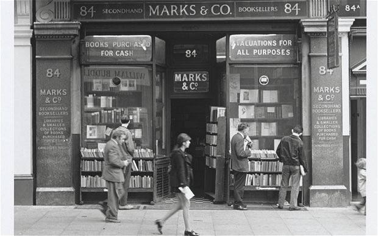

By Helene Hanff，1970
第二次阅读

这本书是一册书信集，记录了纽约女作家Helene 与一家书店的书商经理Frank二十多年来互通书信的故事。
<!--more-->
最初，他们书信的内容仅限于书目。由于共同的喜爱和对书的品位，他们开始逐渐熟识。透过写信人的言语表达方式，他们对书信背后的人有了更多的了解，Helene幽默，Frank真诚。后来，除了书信往来，互赠包裹礼物也成为日常。他们彼此分享生活琐碎，谈论喜好和感想，虽然至始至终不曾见面，却觉得无比亲切。Helene经常给Frank一家和书店的人寄去稀缺的食物和日用品，Frank则到处搜集好书，为Helene寄来她钟爱的书籍，彼此相互关爱。他们之间这种美好而奇妙的关系，同时也感染了周围的朋友和家人，这也加深了他们的情谊。然而，20多年来，由于种种原因，他们从未见到过对方。直到Frank去世之后，Helene终于来到了这家书店。这里的场景和布置，她已经想象过无数次，但是现在，这里的一切似乎随着Frank的逝去也走向了终点。不久之后，书店面临关闭。其后，这里变成了CD售卖店，然后是零售店，再然后是饭馆。似乎最近，麦当劳的香味正从这里飘出。

## 印象深刻的地方
**幽默的Helene与认真的Frank**
 "Frank Doel, what are you DOING over there, you are not doing ANYthing, you are just sitting AROUND."她提出的各种绝版Olde English books需求，他总能设法找到，并且对版本了熟于心。

**Helene与他的编辑吃饭时的聊天。**
“I plunged into an enthusiastic explanation-and Gene shook her head and cut in impatiently:‘You and your Olde English books!’ You see how it is, fankie, you're the only soul alive who understand me. Helene明白，只有Frank能够理解自己对Olde English books的喜爱，并且给予最大的支持和帮助。

**有关i-was-there books**
"Anybody wants to know what it was like to live in the time of Oliver Cromwell can flop on the sofa with Milton on his pro side and Walton on his con, and they will not only tell him what it was like, they'll take him there. That's for me, I'm a great lover of i-was-there books.好书似乎具有一种神奇魔力，能够带领我们穿越时空，仿佛身临其境。

**像扔掉旧衣服一样扔掉不会再看的书**
"I houseclean my books every spring and throw out those I'm never going to read again like I throw out clothes I'm never going to wear again...The way they look at it, you buy a book, you read it, you put it on the shelf, you never open it again for the rest of life but YOU DON'T THROW IT OUT!NOT IF IT HAS A HARD COVER ON IT!"有意思的观点！

**Nora写给Helene的信**
Nora是Frank的妻子，她给Helene写过为数不多的几封信（并且她也说过自己不喜欢写信）。在这些信中，附上了他们的家庭合照，并大篇幅地谈论他们幸福的家庭生活情况，以及他们的子女。我隐隐约约感觉到，Naro之所以给Helene写信，一方面是表达对Helene寄来生活物资的感谢，另外还有一部分原因像是在宣誓主权，害怕自己丈夫被人抢走，以及暗示Helene不要破坏他们的幸福家庭。当Frank去世后，这些隐含的情绪在Naro写给Helene的一封信中清楚显现。这封信里，她勇敢且毫无保留地袒露了自己的心声。"At times I don't mind telling you I was very jealous of you, as Frank so enjoyed you letters and they or some were so like his sense of humour. Also I envied your writing ability. Frank and me were so very much opposited, he so kind and gentle and me with my Irish background always fighting for my rights. I miss him so, life was so interesting, he always explaning and trying to teach me something of books. My girls are wonderful and in this I am lucky. I suppose so many like me are all alone."Helene似乎也领会了Naro的心思，但是她却从未给Naro回信，只是偶尔在给Frank的信里向Naro和他们的孩子问好。或许，在Helene心里，她同样也是非常挣扎。

**书店其他职员与Helene的通信**
"of course on one else quite dares to write to Frank's Miss Hanff."通过他们，Helene知道了Frank的一些个人信息和家庭情况。不同于对Nora, Helene一一回复了这些职员的信，并与他们保持较多的书信来往。在这些职员离开书店后，Helene还一直向Frank询问他们的近状。这些细节仿佛也证实了上面我的某些猜想，哈哈哈。

## 写在最后
这本书被誉为“爱书人圣经”的书信集，被译成数十种文字流传，广播、舞台和银幕也钟情与它（2016年《北京遇上西雅图之不二情书》）。可能是因为这个故事里流露出的简单而真挚的情感，正是人人心向往之，梦寐以求的吧。尤其是发生在两个素未蒙面的陌生人身上，且持续时间长达二十来余年。或许正是因为两人从未见面的缘故，也为这个故事带来了一份朦胧的美感，故而让人难以忘怀。

"You see how it is, fankie, you're the only soul alive who understand me."高山流水，莫过于此。

另外，对于已经习惯使用即时通讯的现代人来说，写信和收信时的感受恐怕再也难以感同身受了。我猜测，收信时的期待感受，可能与收到朋友寄来的礼物有些相似；而写信时的感受，我却很难猜想得到了。或许是，虽心有千言万语，却反复辗转思绪，随后才斟酌下笔。谁知道呢？