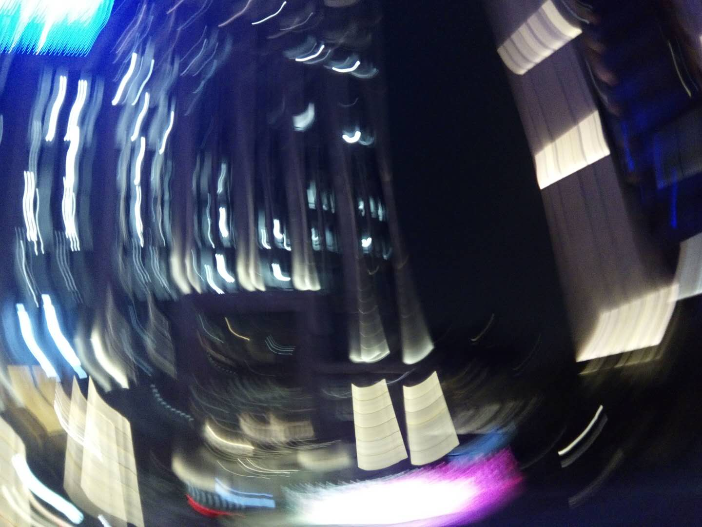
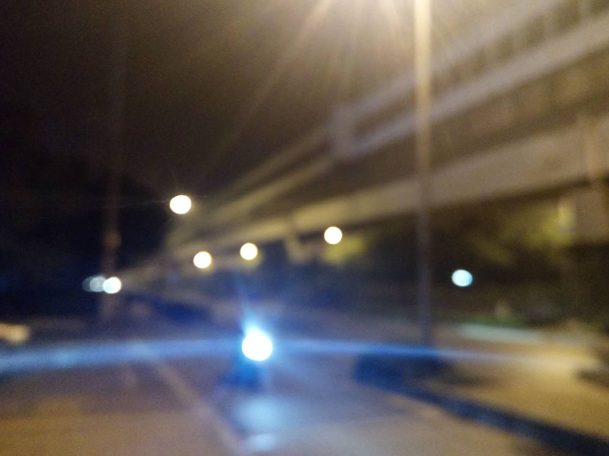

上海，我又来了，带着一身的戾气。已是10多年的老友，她显然是察觉到了，在我说出口之前。其实，我也不知该对她从何说起。
<!--more-->
“这次的你，跟7月的那个时候有些不一样，但我不喜欢现在的你。”在她面前，我把费尽力气才穿上的拙劣铠甲卸下了，赤裸裸，毫无保留，袒露出一个状态十分糟糕的我。“感觉你很紧绷，你刚才说话时的样子，咄咄逼人，真的很不好。”

我没法看到自己说话时的神情，但可想而知，肯定非常难看。我也不喜欢这样的我，像一块冰凉的石头。当时，她正在给我讲她的近况，她的烦恼，她的生活。

“要是以前的你，听到我说的这些，你的反应会是长叹一声‘哦’。但是刚才，你却总让我不要谈‘假设’，仿佛是争辩些什么，这很奇怪。”果然，一身戾气的我，做不好一个合格的倾听者。而现在的我，是该需要和人聊一聊了，一个坐在我面前的人，一个信赖的人，一个可以暂时将时间腾给我一会儿，而我不会产生亏欠感的人。北京的朋友们很好，只是大家太忙了，忙到我不敢打扰他们。

说着说着，我又哭了，也不知道这是多少次了。桌子上，厕所里，马路旁。发现令人感到寒冷的，不只是北京的冬天和寒风。有时会感觉，自己的生活似乎陷入了一个怪圈之中，每日重复着单调，波澜不惊，却也毫无生气。我本来是不打算参加这次活动的，但我实在太想让生活有一些变化了，至少是环境的转换，所以劝说自己再次来到了上海，或许期待在这里找到些什么吧。

可是，生活在别处就能改变什么吗？不过是缓兵之计，也可能是暂时的逃避。在家，上海，深圳，北京之间，上海对我而言是一个中间站，连接着过去和现在的自己。过去那个不知天高地厚，豪情万丈的你，现在却为何时常黯然神伤，唏嘘感叹？或许只是“少年不知愁滋味，为赋新词强说愁”，我说不清，也看不透。

城市是什么？人群的容器。上海，这座拥挤的城市，人来人往，川流不息。我们来过，走了，然后又来了。来时，双眼清澈，满心期待；走时，恋恋不舍，依依惜别；而现在呢，一身的疲惫，眼神黯淡。那些往日种种，漂浮在空气中，似乎清晰，也好像模糊。曾视为重要的一些事，早已流逝；而一些不经意的小细节，却记忆犹新。总以为，是环境在我们身上留下了烙印，原来，我们也在环境里留下了影子。

7月的上海，天气很热；11月的上海，感觉很暖。8个月后，上海再见。
